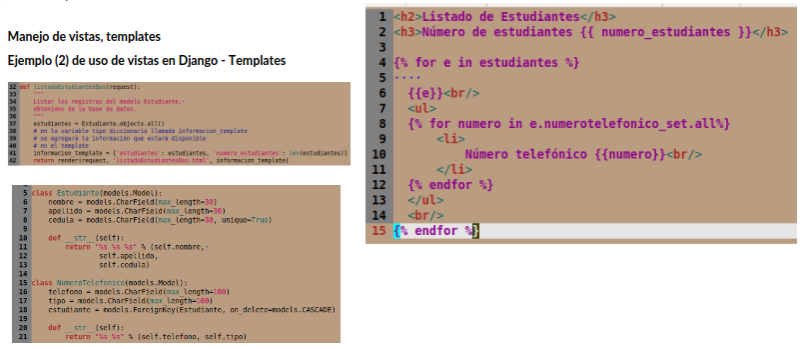

# clase03-2bim

Asi podemos llamar a cada objeto numero_telefonico de ese estudiante en especifico.

### 25 de junio
La funcion 'crear_numero_telefonico_estudiante' nos deberia ayudar al agregar un numero de telefono asociado a un estudiante que ya este creado para ya no tener que volver a elegir el estudiante, utilizando el metodo 'forms.widgets.HiddenInput()' para que al agregar ya no elija otra vez el estudiante porque al estudiante se lo va a ocultar.